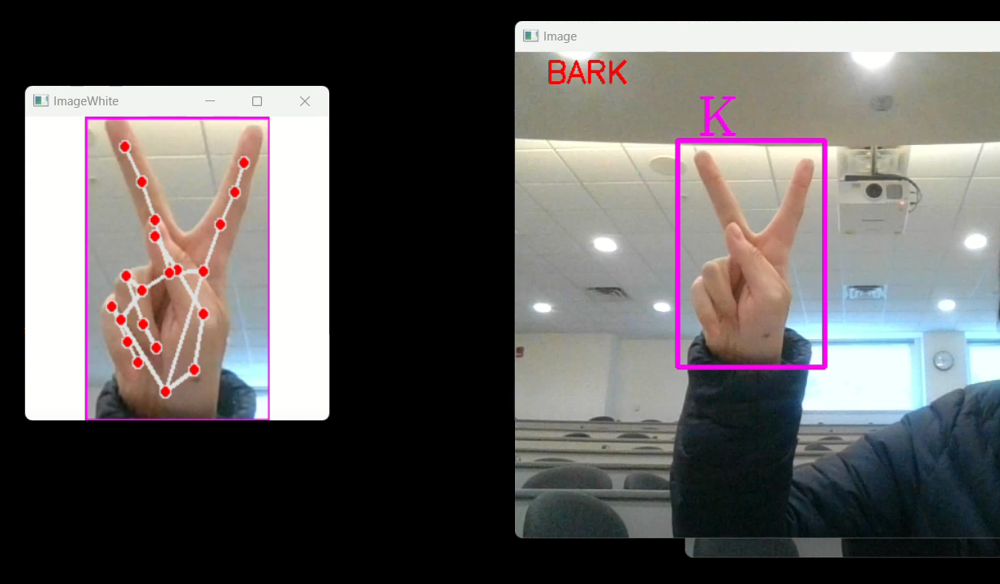
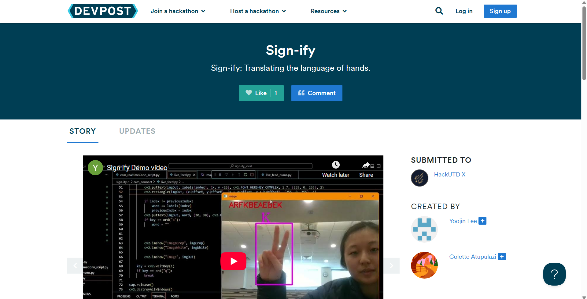

# Sign-ify


## Project Overview

Sign-ify is an application designed to recognize and translate sign language gestures using machine learning and computer vision. Built for students, educators, and anyone interested in accessible communication, the project aims to bridge the gap between spoken and sign language. With a user-friendly React web interface and real-time webcam integration, Sign-ify makes learning and translating sign language fast and interactive.

Currently, Sign-ify recognizes a subset of static hand signs representing a few letters of the alphabet. With additional development, the project could potentially support a wider range of signs, including dynamic gestures.

Standout features include a responsive UI, real-time gesture recognition, and no backend server required for basic usage. 

## Tech Stack

- Python (data collection, model training, and webcam integration)
- TensorFlow/Keras (machine learning models)
- OpenCV (image processing)

## Features

- Real-time sign language recognition via webcam
- Easy-to-use for both beginners and advanced users
- Cumulative letter tracking to form complete words as you sign
- Fast, on-device inference using pre-trained Keras models
- Scalable architecture for adding new gestures or models
- No backend required for core functionality

## Demo

Sign-ify in action: The right window displays the full camera feed with hand detection, letter prediction, and cumulative word formation. The left window shows a cropped view focused on the hand, overlaid with a CVZone-generated skeletal model for gesture tracking.



A comprehensive demonstration video, along with a detailed project description and technical breakdown, is available on our Devpost page. https://devpost.com/software/sign-ify-sb8tra 



## Setup Instructions

> **Note:** This project requires Python 3.10 due to TensorFlow and other dependency compatibility.

1. **Clone the repository:**
   ```sh
   git clone https://github.com/yourusername/sign-ify.git
   cd sign-ify
2. **Install Python dependencies:**
    ```sh
    pip install -r requirements.txt
3. **Start the Python app:**
    ```sh
    python cam_connect/live_feed.py